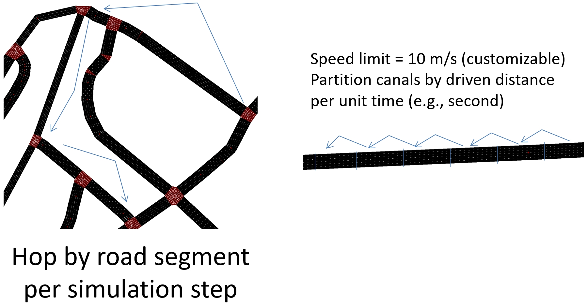
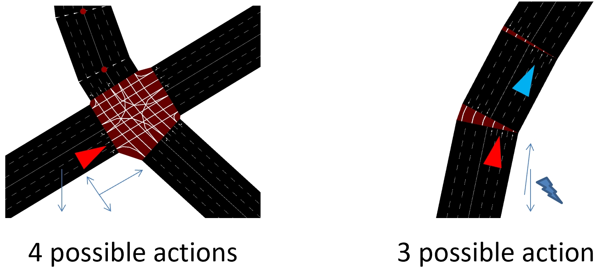

# SUMO-RL-MobiCharger

<!-- start intro -->

SUMO-RL-MobiCharger provides an OpenAI-gym-like environment for the implementation of RL-based mobile charger dispatching methods on the [SUMO](https://github.com/eclipse/sumo) simulator. The fetures of this environment are three-fold:

- A simple and customizable interface to work with Reinforcement Learning for Dispatching of Mobile Chargers on city-scale transportation network with SUMO
- Compatibility with OpenAI-gym and popular RL libraries such as [stable-baselines3](https://github.com/DLR-RM/stable-baselines3) and [RL Baselines3 Zoo](https://github.com/DLR-RM/rl-baselines3-zoo)
- Easy modification of state and reward functions for research focusing on vehicle routing or scheduling problems

|  | 
|:--:| 
| *Blue vehicles are mobile chargers, yellow vehicles are electric vehicles, green highlight means charging between mobile chargers and EVs, and blue highlight means charging between mobile chargers and charging stations* |

<!--<p>
    
</p>
<p>
    <em>Blue vehicles are mobile chargers, yellow vehicles are electric vehicles, green highlight means charging between mobile chargers and EVs, and blue highlight means charging between mobile chargers and charging stations</em>
</p>-->

The main class is [SumoEnv](canalenv/envs/canalenv_gym.py). To train with RL Baselines3 Zoo, you need to register the environment as in their [doc](https://rl-baselines3-zoo.readthedocs.io/en/master/guide/custom_env.html) and add the following code to ```exp_manager.py```:

```python
# On most env, SubprocVecEnv does not help and is quite memory hungry
# therefore we use DummyVecEnv by default
if "SumoEnv" not in self.env_name.gym_id:
    env = make_vec_env(
        make_env,
        n_envs=n_envs,
        seed=self.seed,
        env_kwargs=self.env_kwargs,
        monitor_dir=log_dir,
        wrapper_class=self.env_wrapper,
        vec_env_cls=self.vec_env_class,
        vec_env_kwargs=self.vec_env_kwargs,
        monitor_kwargs=self.monitor_kwargs,
    )
else:
    def make_env(
        env_config={
            'gui_f':False, 
            'label':'evaluate'
        }, rank: int = 0, seed: int = 0
        ):
        def _init():
            env = gym.make('SumoEnv-v0', **env_config)
            env = Monitor(env, log_dir)
            env.seed(seed + rank)
            env.action_space.seed(seed + rank)
            return env
        set_random_seed(seed)
        return _init
    
    if eval_env:
        if self.verbose > 0:
            print("Creating evaluate environment.")
            
        env = SubprocVecEnv([make_env() for i in range(n_envs)])
    else:
        env = SubprocVecEnv([make_env(
            {
                'gui_f':False, 
                'label':'train'+str(i+1)
            }, rank=i*2) for i in range(n_envs)])
```

For training, use the following command line:
  
```bash
python train.py --algo ppo --env SumoEnv-v0 --num-threads 1 --progress --conf-file hyperparams/python/sumoenv_config.py --save-freq 500000 --log-folder /usr/data2/canaltrain_log/ --tensorboard-log /usr/data2/canaltrain_tensorboard/ --verbose 2 --eval-freq 2000000 --eval-episodes 10 --n-eval-envs 10 --vec-env subproc
```

<!-- end intro -->

## MDP - Observations, Actions and Rewards

### Observation

<!-- start observation -->

The default observation for the agent is a vector:
```python
    obs = [SOC_state, charger_state, elig_act_state, dir_state, charge_station_state]
```
- ```SOC_state``` indicates the amount of SOC on the road network pending to be refilled by mobile chargers
- ```charger_state``` indicates current road segment, staying time, charging_others bit, charge_self bit, SOC, distance to target vehicle and neighbor_vehicle bit of each mobile charger
- ```elig_act_state``` indicates the eligible actions that each mobile charger can take at current road segment
- ```dir_state``` indicates the best action of each mobile charger given its current road segment
- ```charge_station_state``` indicates the remaining SOCs that the mobile chargers will have if they go to the charging stations for a recharge

<!-- end observation -->

### Action

<!-- start action -->

The action space is discrete. Each edge in SUMO network is partitioned into several road segments:
    
<p align="center">

</p>

Thus, the possible actions of the agent at each road segment can be illustrated as:

<p align="center">

</p>

Througout the road network, a mobile charger can only take maximally 6 actions: stay(0), charge vehicles (1), downstream road segments (2-4).

<!-- end action -->

### Rewards

<!-- start reward -->

The default reward function is the change in cumulative vehicle delay:

<p align="center">

</p>

That is, the reward is how much the total delay (sum of the waiting times of all approaching vehicles) changed in relation to the previous time-step.

You can choose a different reward function (see the ones implemented in [TrafficSignal](https://github.com/LucasAlegre/sumo-rl/blob/master/sumo_rl/environment/traffic_signal.py)) with the parameter `reward_fn` in the [SumoEnvironment](https://github.com/LucasAlegre/sumo-rl/blob/master/sumo_rl/environment/env.py) constructor.

It is also possible to implement your own reward function:

```python
def my_reward_fn(traffic_signal):
    return traffic_signal.get_average_speed()

env = SumoEnvironment(..., reward_fn=my_reward_fn)
```

<!-- end reward -->


## Citing

<!-- start citation -->

If you use this repository in your research, please cite:
```bibtex
@article{yan2022mobicharger,
  title={MobiCharger: Optimal Scheduling for Cooperative EV-to-EV Dynamic Wireless Charging},
  author={Yan, Li and Shen, Haiying and Kang, Liuwang and Zhao, Juanjuan and Zhang, Zhe and Xu, Chengzhong},
  journal={IEEE Transactions on Mobile Computing},
  volume={Early Access}, 
  year={2022},
  publisher={IEEE}
}
```

<!-- end citation -->
